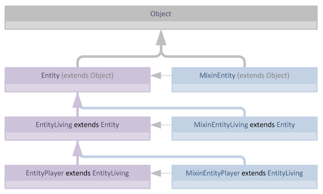
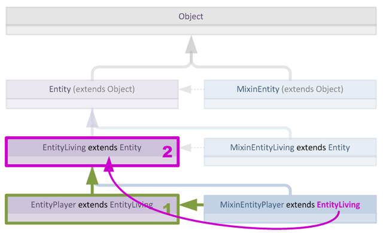
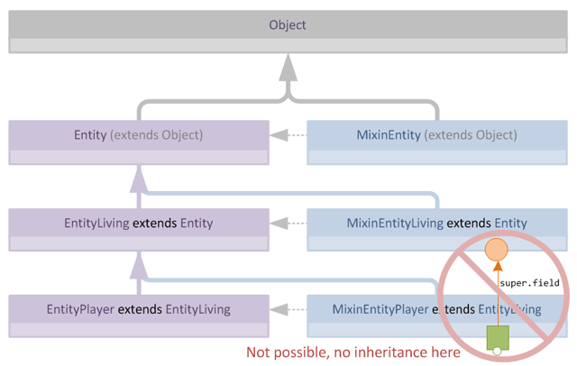
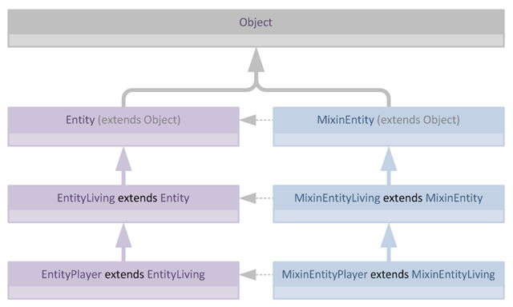
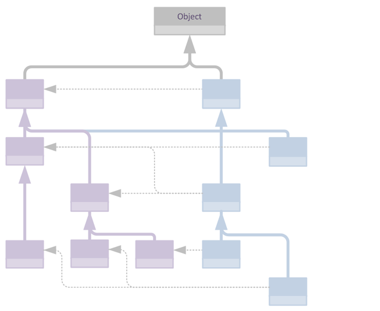
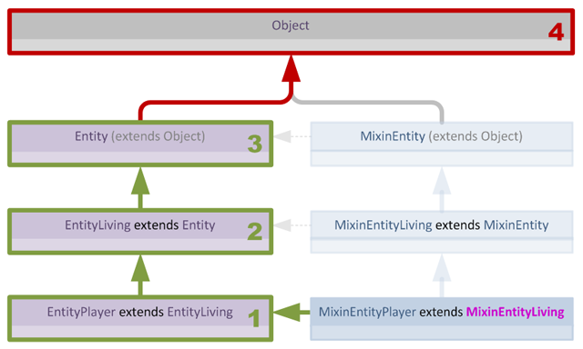
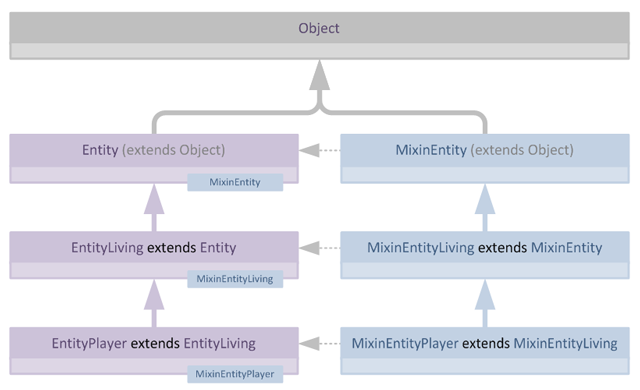
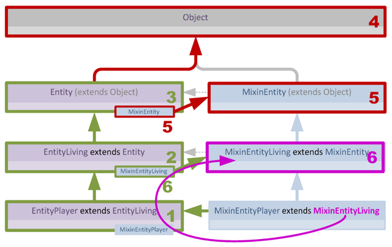

> 本文翻译自：[About Hierarchy Validation in Mixins](https://github.com/SpongePowered/Mixin/wiki/About-Hierarchy-Validation-in-Mixins)

到现在我应该不需要再提醒你**Mixin不是类**了吧？希望如此。然而，从纯机械的角度来看，Mixin和普通Java类一样都是*使用javac编译*的，因此在编写它们时有一些需要注意的事项，其中许多我已在之前的章节中介绍过。

Mixin变得棘手的一个场景是：当多个Mixin应用到形成类层次结构的多个类时。如果没有辅助接口来访问父类中Mixin提供的字段和方法，Mixin之间的互操作可能会很麻烦。

正如我们在前面章节所看到的，通常Mixin预期继承其**目标类**的直接父类，或者**目标类**层次结构中的某个父类（直到并包括`java.lang.Object`）。

本节涵盖Mixin实现中较技术性的一个方面：验证Mixin继承自有效的父类。

#### Mixin与并行伪层次结构

对于典型的类层次结构，我们很容易遇到如下场景，每个Mixin都继承其目标的父类：

从这个图中我们可以很容易看出，Mixin本身形成了一个乍看之下像是层次结构的结构，它镜像了其目标类的层次结构。然而，重要的是要意识到，Mixin本身**并不**实际上形成层次结构，它们之间不存在超越概念层面的直接关联。

这种场景的一个好处是验证极其简单，我们可以通过在每个目标类的层次结构中查找Mixin的父类来轻松检查其是否有效。

让我们看看如何验证`MixinEntityPlayer`。这个Mixin目标是`EntityPlayer`并继承`EntityLiving`。要执行验证，我们只需沿`EntityPlayer`的父类层次结构向上遍历，直到找到（或未找到）`EntityLiving`。

我们可以用递归方式表达这个朴素的验证算法：

1. 如果我是**父类**，停止并**返回true**。
2. 如果我是`Object`，停止并**返回false**。
3. 向上走到**我的**父类，然后从步骤1重复并返回结果。

从视觉上看，我们的验证过程是这样的：

如我们所见，使用此算法对此场景的验证只需两步：

1. 首先遍历到Mixin目标类`EntityPlayer`
2. 接着沿层次结构向上走1步到达`EntityPlayer`的父类，此时验证成功，因为找到了父类。

然而这种效率是有代价的：由于我们的Mixin实际上并不互相继承，因此无法立即访问由Mixin添加到父类中的字段或方法。

例如，假设`MixinEntityLiving`向其目标类添加了一个新的protected`field`。现在由于`MixinEntityPlayer`继承`EntityLiving`，在**实践中**字段`foo`将可以从`EntityPlayer`访问，但是`EntityPlayer`的Mixin对这个新字段一无所知，因此在**编译时**无法引用它：

### Mixin"继承"

我们可以通过允许Mixin不仅继承目标层次结构中的类，还可以继承其他Mixin来解决这个问题，这使我们在概念上可以创建这样的结构：

然而，虽然这种结构对人类来说容易设计和理解，但对Mixin子系统来说验证起来相当困难，这是因为单个Mixin无法知道其（声明的）父类最终是否会出现在其**目标**的父类层次结构中。

看着上面的图表，可能会认为验证很简单甚至不需要，但由于Mixin可以有多个目标，多个Mixin也可以目标同一个类，当Mixin和目标的层次结构不那么简单时，验证会很快变得非常复杂：

父类验证很重要，因为这是在应用Mixin之前验证Mixin中的静态绑定调用是否合理、是否会在应用时正确解析的唯一方法，因此简单地跳过验证并祈祷一切顺利是不安全的。然而我们需要验证尽可能高效，因为它必须在加载时对每个Mixin运行。

重要的是要意识到**每个Mixin**都必须在**其每个目标**的上下文中进行验证，因为正如已经展示的，Mixin目标可能有截然不同的层次结构。这意味着假设一个目标的层次结构可以合理解析就认为所有其他目标也是合理的，这是不安全的，仍需对每个目标进行验证。

当我们应用之前朴素的验证方案，简单地在目标层次结构中查找Mixin的父类时，我们遇到了问题，验证失败：

现在我们**可以**通过沿Mixin层次结构向上遍历来解决这个问题，对于*每个*父Mixin，在所讨论的Mixin目标的父类层次结构中查找其每个目标。然而这种方法在处理多目标Mixin时很快会变得非常昂贵，因为对于*每个*父Mixin目标，我们必须搜索派生Mixin的*每个*目标的父类层次结构来找到匹配。这可能导致对于一个表面上很简单的验证任务进行大量查找。

解决方案实际上相当简单：我们只需将Mixin加载分成两个不同的**阶段**。在**第一阶段**，我们生成一些额外的元数据，用于填补我们对层次结构认知的空白。具体来说，我们让每个加载的Mixin用指向自身的指针"标记"其目标类。这意味着目标类现在*知道*哪些Mixin正在目标它：

有了这个新信息，我们可以在**第二阶段**执行验证，知道我们的层次结构信息是完整的，并修改我们的递归算法以利用新数据：

1. 如果我是**父类**，停止并**返回true**。
2. 如果我是`Object`，停止并**返回false**。
3. 向上走到**我的**父类，然后从步骤1重复并记录结果。
4. 如果步骤3的结果是**false**，检查每个已标记的Mixin：
   - 如果**任何Mixin**是我们寻找的**父类**，**返回true**
   - 如果**没有Mixin**是我们寻找的**父类**，**返回false**

如你所见，验证仍然是*深度优先搜索*。然而现在我们有了一个次要策略可在搜索失败时使用，即在沿树返回时检查已标记的Mixin。这最终意味着我们搜索的复杂度是线性的，只比之前略贵一些，因为仍然需要完整遍历目标的父类层次结构，但每个目标最多一次，这要可接受得多。
