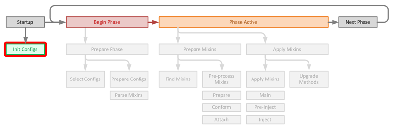
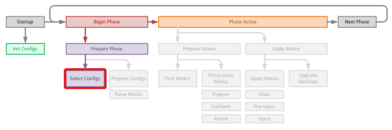
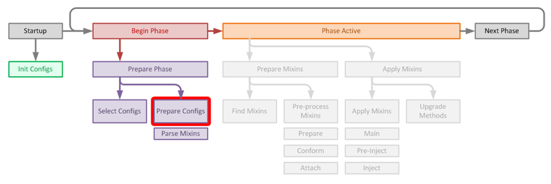
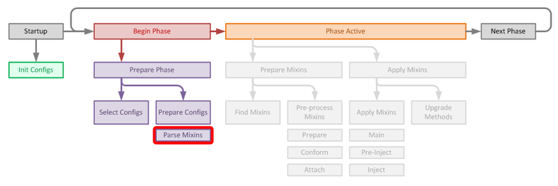
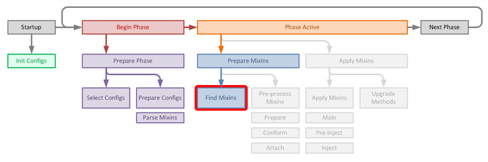
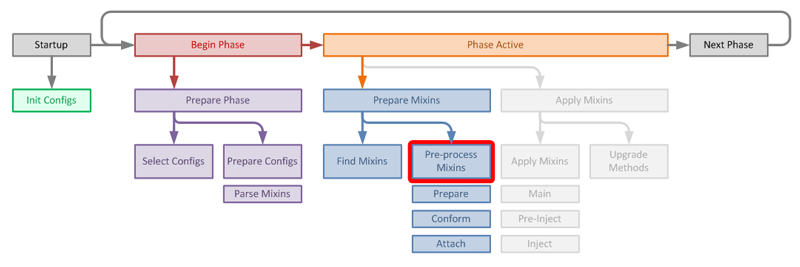
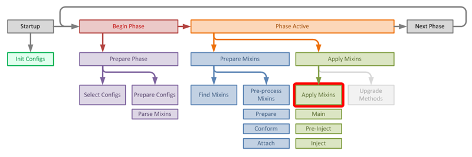
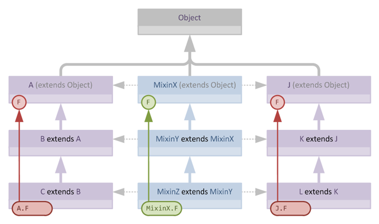
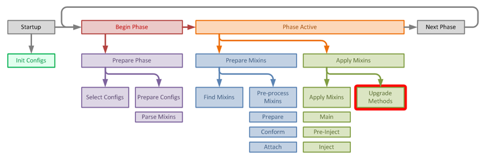

> 本文翻译自：[Flippin' Mixins, how do they work?](https://github.com/SpongePowered/Mixin/wiki/Flippin'-Mixins,-how-do-they-work%3F)

我时不时会看到有人批评Mixin，说它太复杂了，或者对于特定的工作来说有些大材小用。因此，本文旨在准确解释Mixin是如何工作的，以消除人们对其过于复杂的担忧——事实上，我希望能够展示，它*恰恰具有完成其工作所需的复杂程度*——通过解释子系统中每个部分的功能及其运作方式。

本文的目标是让那些熟悉字节码操作，特别是熟悉ASM的人，对Mixin的核心有一个全面的了解，理解其生命周期以及某些乍看之下可能显得晦涩的设计决策背后的原因。

> 为了避免本文变得难以导航，我将假设读者对Mixin的功能集、Java类和字节码的结构以及ASM有一定的了解。这是一篇技术文章，真正适合的是那些对Mixin内部工作原理和生命周期感兴趣的人。我已经尽力用通俗易懂的英语来写，但如果你对前面提到的主题没有很好的理解，我不能保证这篇文章会有什么意义。

# 1. 原理

归根结底，Mixin的核心是获取两组字节码——目标类的字节码和Mixin“类”的字节码——然后将它们合并在一起。ASM提供了多种方法来实现这一点，但坦率地说，任何使用ASM超过五分钟的人都会意识到一个重要的事实：

* 使用ASM合并字节码极其简单

事实上，它简单到我们可以用8行ASM代码将一个方法从一个类复制到另一个类：

```java
ClassNode source = new ClassNode();
ClassNode dest = new ClassNode();
new ClassReader(sourceBytes).accept(source);
new ClassReader(destBytes).accept(dest);
source.methods.stream().filter(m -> m.name.equals("foo")).forEach(dest.methods::add);
ClassWriter cw = new ClassWriter(0);
dest.accept(cw);
return cw.toByteArray();
```

这甚至不是最简单或最有效的方法，只是最短的方法。

显然，我们知道这只有在源方法经过精心设计的情况下才能工作，而且如果已经存在冲突的方法，事情就会立即崩溃。由于ASM不检查我们所做的工作是否有效，它只是为我们提供操作底层类字节的工具，所以这很容易出错。

但是，假设我们可以检查明显的前提条件——这肯定很容易检查——**那么所有的复杂性从何而来**？

答案是，Mixin承担了大量的工作，以确保传入的Mixin代码既合理又正确，同时还提供了远远超出单个目标类范围的功能。事实是：

* 以**安全可靠的方式**使用ASM合并字节码是非同寻常的困难

接下来的章节将介绍Mixin提供的一些功能，它试图解决的问题，并解释它如何尝试解决这些问题。这主要是通过梳理Mixin的生命周期并解释它的功能及其运作方式来实现的。

# 2. 功能集

如果Mixin作者对自己的行为承担全部责任，理解JVM的内部工作原理，并且能够精心设计传入的Mixin以不违反任何规则，那么以简单的方式合并字节码是可以的。然而，Mixin的主要目标之一一直是一种变形者版本的希波克拉底誓言——“不造成伤害”。如果Mixin无效，Mixin应该快速失败，理想情况下应该提供有意义的错误信息。这样，责任就落在Mixin作者身上——*编写有效的Mixin*，而Mixin的责任是将*有效的Mixin*转换为目标中的*有效的字节码*。我们还希望为Mixin作者提供功能，使他们能够以直接的方式编写强大的Mixin。

## 2.1 目标类作用域

Mixin中导致最多支撑代码的功能之一是支持超出目标类范围的操作，特别是引用超类或同一类上其他Mixin添加的成员的操作。

验证层次结构操作最复杂的方面之一是访问目标类超类上的字段和方法，而这些字段和方法本身是由另一个Mixin添加的，这是通过让派生Mixin扩展超Mixin来实现的。这是一个如此复杂的话题，以至于它已经有了[自己的文章](https://github.com/SpongePowered/Mixin/wiki/About-Hierarchy-Validation-in-Mixins)。

## 2.2 “软”操作

由于JVM的工作方式，我们可以在Mixin中做一些在Java中永远不会有效，但在字节码中有效的事情。支持这些操作需要为这些操作定义一种“软”语法，这种语法可以在应用时转换为真正的代码。示例包括“软实现”接口、定义*内联代理*，以及合并具有冲突签名但返回类型不同的方法。

## 2.3 对其他Mixin的感知

Mixin的设计考虑到了对其他Mixin的感知。Mixin之间的协商通过简单的优先级系统、更复杂的*伴生插件*系统以及诸如`@Final`注解之类的契约功能来提供。

特定目标类的所有消费者提供的所有Mixin都在一次处理流程中应用，因此Mixin以可预测且最终确定性的方式相互交互。

## 2.4 快速失败或安全失败

归根结底，我们永远不希望最终处于一种允许“坏”字节码一路进入ClassLoader的情况。我们希望我们的Mixin以可预测的方式快速失败——理想情况下提供尽可能多的信息，或者至少“安全失败”，即注入的代码始终有效或完全保持未合并状态。

## 2.5 兼容性和环境感知

除了Mixin解决[混淆边界](https://github.com/SpongePowered/Mixin/wiki/Introduction-to-Mixins---Obfuscation-and-Mixins#2-resolving-the-identity-crisis---defining-the-obfuscation-boundary)概念和不同混淆环境的核心功能外，Mixin进行的实际转换应始终考虑运行时环境中其他类转换器的操作。这种感知有助于实现上一个目标：如果转换器以我们意想不到的方式更改了类，我们要检测到这种情况，*快速失败或安全失败*。

## 2.5 效率

我们希望以最有效的方式实现上述所有目标。显然，速度和内存使用之间存在权衡，通常Mixin会倾向于使用更多内存作为获得更快速度的机会。

在Mixin的最近版本中，我已经开始对Mixin过程的不同部分进行性能分析，正如预期的那样，绝大多数时间实际上都花在侧加载和转换类上（见下面关于ClassInfo的章节），这些最终无论如何都需要发生。总的来说，考虑到其功能，Mixin处理器的核心速度是可以接受的。

# 3. 生命周期

现在我们知道了我们想要实现什么，现在是时候深入了解转换器的内部，看看不同的类是如何交互的。本讨论将讨论Mixin核心中不同类的作用，因此我将尽可能链接到相关的源代码。

我将跳过子系统中的平台特定操作，只讨论Mixin过程本身。这主要是因为平台特定的处理程序负责低级别的jar、Tweaker和重映射代理的编组，整个话题坦率地说相当枯燥，并不能增加对Mixin本身的理解，所以我不会离题。

## 3.1 启动

Mixin作为一个子系统需要在某个地方启动，这通常由一个或多个代理发起。环境中的所有消费者将与Mixin子系统的单个实例交互，因此负责引导的方除了使用哪个版本外，对Mixin的操作影响不大。

除了注册相关的伴生对象外，消费者执行的主要任务是将他们的Mixin配置文件注册到子系统本身。

有些人会惊讶地发现，Mixin要求将Mixin添加到配置文件中。*“为什么”*——他们问——*“Mixin不能像我们扫描模组那样扫描jar中的Mixin类呢？”*对此的回答是，主要原因是速度，扫描jar相当昂贵，使用配置文件意味着我们还可以指定很多重要的附带信息。这也意味着jar中可以存在未应用的Mixin，或者通过使用伴生插件选择性地应用Mixin。



当添加配置时，它们会通过内部反序列化为[MixinConfig](https://github.com/SpongePowered/Mixin/blob/master/src/main/java/org/spongepowered/asm/mixin/transformer/MixinConfig.java)实例来立即解析。解析配置确定以下属性：

* 所需的兼容性级别——如果所需的级别不可用，我们可以快速失败

* 所需的Mixin子系统版本——同样，如果使用的版本太旧，快速失败

* 配置所需的*阶段*——稍后详细介绍阶段

配置中的Mixin列表被反序列化但未被解析，配置中的Mixin在配置本身被阶段开始激活之前不会被解析。

除了收集配置外，Mixin还注册自己的*类转换器*，这然后成为Mixin大部分其余功能的入口点。

## 3.2 开始一个阶段

首先，让我们回答这个问题*“为什么Mixin有阶段？”*

正如我们稍后将会看到的，在开始应用Mixin之前，我们实际上需要收集相当多的信息。依赖于付Mixin或其他类转换器所做转换的Mixin需要知道父Mixin是可用的，它们的目标类如预期的那样等等。这意味着在我们开始应用Mixin之前，我们需要知道我们计划应用的所有Mixin。

通常这没问题。Mixin像普通类一样通过转换器链，所有东西一次性加载和处理，然后我们就可以在目标类通过ClassLoader中的实时转换器链时应用Mixin。

然而，由于可能希望——特别是对于其他子系统级技术，如Sponge——将Mixin应用到加载器基础架构的其他部分。简单的解决方案似乎是 *“只需更早地加载Mixin”*。问题是某些Mixin将依赖于被——例如——*Side Transformer*转换，或者在某些情况下依赖于反混淆转换器。在游戏生命周期的最开始，这些转换器不是活动的，因为它们构成了我们希望转换的框架的一部分！

答案是引入*阶段*。因此，`PREINIT`阶段包含需要混入基础设施类的Mixin，这些类不需要依赖于转换器链的完成。稍后的`DEFAULT`阶段Mixin则在转换器链基本完成且游戏处于“准备加载”状态时加载。

### 3.2.1 选择配置

我们已经知道哪些配置希望参与哪个阶段，因此阶段的开始是由满足开始该阶段条件的第一个类通过转换器链触发的。因此，在进入时，[MixinTransformer的首要任务之一](https://github.com/SpongePowered/Mixin/blob/master/src/main/java/org/spongepowered/asm/mixin/transformer/MixinTransformer.java#L451)是检查是否开始了新阶段，并为该阶段*选择*配置。



来自先前阶段的配置总是被保留，在阶段开始时，该阶段的配置从环境的可用阶段列表中被挑选出来，然后按优先级排序到待处理列表中

[MixinConfig](https://github.com/SpongePowered/Mixin/blob/master/src/main/java/org/spongepowered/asm/mixin/transformer/MixinConfig.java)在被选择时执行一些初始自我配置：

* 配置的*伴生插件*（如果指定）被实例化
* 配置的*引用映射*被加载和解析

选择失败的配置从待处理列表中移除，不再被处理。

### 3.2.2 准备配置



通过筛选的[MixinConfig](https://github.com/SpongePowered/Mixin/blob/master/src/main/java/org/spongepowered/asm/mixin/transformer/MixinConfig.java)随后会被初始化。初始化可能是一个相当漫长的操作，因为配置中的Mixin本身必须从磁盘加载和解析。

每个[MixinConfig](https://github.com/SpongePowered/Mixin/blob/master/src/main/java/org/spongepowered/asm/mixin/transformer/MixinConfig.java)包含3个独立的Mixin集——*服务器*、*客户端*和*通用*Mixin，其中*通用*Mixin首先被解析，然后根据检测到的**端**解析*客户端*或*服务器*集。

#### 3.2.2.1 解析Mixin

在准备阶段，[配置](https://github.com/SpongePowered/Mixin/blob/master/src/main/java/org/spongepowered/asm/mixin/transformer/MixinConfig.java)中的Mixin从磁盘加载，每个Mixin被解析为一个[MixinInfo](https://github.com/Spongepowered/Mixin/blob/master/src/main/java/org/spongepowered/asm/mixin/transformer/MixinInfo.java)结构，它处理Mixin的初始解析，并作为所有生成的元数据的存储。



如果Mixin字节码成功加载，[MixinInfo](https://github.com/SpongePowered/Mixin/blob/master/src/main/java/org/spongepowered/asm/mixin/transformer/MixinInfo.java)继续收集Mixin所需的信息：

* Mixin的[State](https://github.com/SpongePowered/Mixin/blob/master/src/main/java/org/spongepowered/asm/mixin/transformer/MixinInfo.java#L162)被初始化。[State](https://github.com/SpongePowered/Mixin/blob/master/src/main/java/org/spongepowered/asm/mixin/transformer/MixinInfo.java#L162)是一个用于保存Mixin字节码和从Mixin类解析的未验证细节的结构。[State](https://github.com/SpongePowered/Mixin/blob/master/src/main/java/org/spongepowered/asm/mixin/transformer/MixinInfo.java#L162)作为[MixinInfo](https://github.com/SpongePowered/Mixin/blob/master/src/main/java/org/spongepowered/asm/mixin/transformer/MixinInfo.java)中的独立结构维护，用于验证目的，并作为脚手架以便于应用生命周期后期的热交换。

* 为Mixin创建一个[ClassInfo](https://github.com/SpongePowered/Mixin/blob/master/src/main/java/org/spongepowered/asm/mixin/transformer/ClassInfo.java)。

 > [ClassInfo](https://github.com/SpongePowered/Mixin/blob/master/src/main/java/org/spongepowered/asm/mixin/transformer/ClassInfo.java)在Mixin中被广泛使用。[ClassInfo](https://github.com/SpongePowered/Mixin/blob/master/src/main/java/org/spongepowered/asm/mixin/transformer/ClassInfo.java)用于访问和存储类元数据，而不使用反射（反射会触发类加载），方法是侧加载类并手动将其通过转换器链。
 >
 > [ClassInfo](https://github.com/SpongePowered/Mixin/blob/master/src/main/java/org/spongepowered/asm/mixin/transformer/ClassInfo.java)存储与Java`Class`对象类似的信息，但重点关注Mixin所需的信息。为此，[ClassInfo](https://github.com/SpongePowered/Mixin/blob/master/src/main/java/org/spongepowered/asm/mixin/transformer/ClassInfo.java)是可变的，记录哪些Mixin作用于哪些类，并记录Mixin所做的更改，从而让这些修改对其他Mixin可见。
 >
 > 为[ClassInfo](https://github.com/SpongePowered/Mixin/blob/master/src/main/java/org/spongepowered/asm/mixin/transformer/ClassInfo.java)目的而侧加载的类通过转换器链的一个子集，称为*委托列表*。*委托列表*在进入新阶段时更新，并有意排除任何已知会重入的转换器以及Mixin转换器本身。
 >
 > 虽然侧加载的性能影响似乎很大，但在实践中，最昂贵的操作往往是转换器本身，因为当字节码第二次“真正”加载时，它通常已经存在于内存中，不会产生任何可测量的性能成本。

* Mixin的[SubType](https://github.com/SpongePowered/Mixin/blob/master/src/main/java/org/spongepowered/asm/mixin/transformer/MixinInfo.java#L452)被初始化。确定[SubType](https://github.com/SpongePowered/Mixin/blob/master/src/main/java/org/spongepowered/asm/mixin/transformer/MixinInfo.java#L452)的标准很简单：

   * 如果Mixin是一个`类`，它是一个[标准Mixin](https://github.com/SpongePowered/Mixin/blob/master/src/main/java/org/spongepowered/asm/mixin/transformer/MixinInfo.java#L526)

   * 如果Mixin是一个`接口`且只包含*访问器方法*，那么它是一个[访问器Mixin](https://github.com/SpongePowered/Mixin/blob/master/src/main/java/org/spongepowered/asm/mixin/transformer/MixinInfo.java#L601)

   * 否则它是一个[接口Mixin](https://github.com/SpongePowered/Mixin/blob/master/src/main/java/org/spongepowered/asm/mixin/transformer/MixinInfo.java#L571)

* 然后从`@Mixin`注解中解析Mixin*目标类*。首先解析作为类字面量指定的公共目标，然后解析作为字符串指定的软目标。

  每个目标首先根据Mixin配置的*伴生插件*（如果有）检查其合法性，然后为每个成功的目标获取一个[ClassInfo](https://github.com/SpongePowered/Mixin/blob/master/src/main/java/org/spongepowered/asm/mixin/transformer/ClassInfo.java)。如果目标不存在，准备阶段将在此处快速失败。

  成功发现的目标会根据[SubType](https://github.com/SpongePowered/Mixin/blob/master/src/main/java/org/spongepowered/asm/mixin/transformer/MixinInfo.java#L452)检查其合法性（例如，确保接口Mixin不以类为目标）。

#### 3.2.2.2 完成配置准备


当每个[MixinInfo](https://github.com/SpongePowered/Mixin/blob/master/src/main/java/org/spongepowered/asm/mixin/transformer/MixinInfo.java)完成解析阶段时，父[MixinConfig](https://github.com/SpongePowered/Mixin/blob/master/src/main/java/org/spongepowered/asm/mixin/transformer/MixinConfig.java)将目标类纳入到自己本地的目标集中，这使得配置能够判断任意给定的目标类是否有Mixin需要应用。

### 3.2.3 验证配置

准备[MixinConfig](https://github.com/SpongePowered/Mixin/blob/master/src/main/java/org/spongepowered/asm/mixin/transformer/MixinConfig.java)生成了该阶段的配置和Mixin的全集，此时我们知道该阶段的所有Mixin都已成功解析，所有预期的*目标类*都已知。

在这个阶段，进行验证处理流程，访问每个[MixinConfig](https://github.com/SpongePowered/Mixin/blob/master/src/main/java/org/spongepowered/asm/mixin/transformer/MixinConfig.java)并使其触发其子[MixinInfo](https://github.com/SpongePowered/Mixin/blob/master/src/main/java/org/spongepowered/asm/mixin/transformer/MixinInfo.java)的验证。

[MixinInfo](https://github.com/SpongePowered/Mixin/blob/master/src/main/java/org/spongepowered/asm/mixin/transformer/MixinInfo.java)的验证处理 访问保留了在解析阶段创建的初始`ClassNode`的[State](https://github.com/SpongePowered/Mixin/blob/master/src/main/java/org/spongepowered/asm/mixin/transformer/MixinInfo.java#L162)。*State*对Mixin执行检查，以确保它相对于其解析的[SubType](https://github.com/SpongePowered/Mixin/blob/master/src/main/java/org/spongepowered/asm/mixin/transformer/MixinInfo.java#L452)和*目标类*是合法的：

  * 构造一个*MixinPreProcessor*并执行`prepare`操作，然后对每个*目标类*执行`conform`（见后面关于一致化的章节）。该过程会为每个*目标类[ClassInfo](https://github.com/SpongePowered/Mixin/blob/master/src/main/java/org/spongepowered/asm/mixin/transformer/ClassInfo.java)*装饰已一致化的注入器方法。这是在前期阶段完成的，以便注入器处理器可以在应用阶段被阶段中的所有其他Mixin正确发现。

  * [SubType](https://github.com/SpongePowered/Mixin/blob/master/src/main/java/org/spongepowered/asm/mixin/transformer/MixinInfo.java#L452)进行基本的健全性检查。进行的主要检查之一是确保Mixin的直接父类出现在每个*目标类*的父类层次结构中。这需要使用[ClassInfo](https://github.com/SpongePowered/Mixin/blob/master/src/main/java/org/spongepowered/asm/mixin/transformer/ClassInfo.java)递归遍历类层次结构，并可能触发进一步的类侧加载以填充此阶段所需的额外元数据。对于*接口Mixin*和*访问器Mixin*，执行更基本的检查。

  * [State](https://github.com/SpongePowered/Mixin/blob/master/src/main/java/org/spongepowered/asm/mixin/transformer/MixinInfo.java#L162)本身进行基本的健全性检查。

  * 访问Mixin中的内部类并内部存储，以便稍后处理。后面的章节有更多细节。

如果[MixinInfo](https://github.com/SpongePowered/Mixin/blob/master/src/main/java/org/spongepowered/asm/mixin/transformer/MixinInfo.java)验证处理流程失败，则记录错误，并从[MixinConfig](https://github.com/SpongePowered/Mixin/blob/master/src/main/java/org/spongepowered/asm/mixin/transformer/MixinConfig.java)的待处理Mixin集中移除该[MixinInfo](https://github.com/SpongePowered/Mixin/blob/master/src/main/java/org/spongepowered/asm/mixin/transformer/MixinInfo.java)。

### 3.2.4 激活配置

通过准备阶段的[MixinConfig](https://github.com/SpongePowered/Mixin/blob/master/src/main/java/org/spongepowered/asm/mixin/transformer/MixinConfig.java)被添加到转换器的活动配置集合中，然后重新排序以确保配置保持优先级顺序。

## 3.3 应用Mixin

### 3.3.1 初始步骤

[Mixin转换器](https://github.com/SpongePowered/Mixin/blob/master/src/main/java/org/spongepowered/asm/mixin/transformer/MixinTransformer.java)除了将Mixin应用到目标类之外，还执行其他任务。由于某些类需要在运行时生成，如果传入的字节码是`null`——意味着指定的类需要根据类转换器的一般约定进行生成——[MixinTransformer](https://github.com/SpongePowered/Mixin/blob/master/src/main/java/org/spongepowered/asm/mixin/transformer/MixinTransformer.java)首先委托给任何注册的[IClassGenerator](https://github.com/SpongePowered/Mixin/blob/master/src/main/java/org/spongepowered/asm/mixin/transformer/ext/IClassGenerator.java)。

#### 3.3.1.1 内部类生成器

Mixin中的内部类需要非常小心地处理。重要的是要注意，从JVM的角度来看，内部类并不是真正的*内部*，内部类所拥有的很多功能只是编译器创建的包私有结构的语法糖，用于创造内部的假象。

这意味着对于内部类，需要为每个Mixin目标类仔细重建合成结构，内部类本身也是如此。因此，如果特定的Mixin`MixinFoo`有一个内部类`MixinFoo$Baz`并且作用于两个类`com.home.Foo`和`com.home.Bar`，则需要制作两个内部类副本：每个目标一个。

我在应用时通过将类引用一致化为目标并附加唯一标识符（以避免恰好具有相同内部类名的多个Mixin之间的冲突！）来处理这种情况。因此，我们一致化的类名将是`com.home.Foo$Baz$abcdef0123`和`com.home.Bar$Baz$defecdb4567`。

每个唯一的名称可以通过内部映射轻松反向推导到特定的目标和源类，因此[InnerClassGenerator](https://github.com/SpongePowered/Mixin/blob/master/src/main/java/org/spongepowered/asm/mixin/transformer/InnerClassGenerator.java)的任务是通过读取原始字节码并将对Mixin（原始外部类）的引用转换为所需的目标类来合成一致化的内部类的字节码。注意，访问转换是不必要的，因为任何“私有”成员都会有合成的包私有访问器来模拟原始的内部类行为。

注意，对于*纯合成内部类*，如果类是静态的，我们不需要这样做，因为目前纯合成内部类的唯一来源是用于switch查找。对于这些类，我们只是按原样传递类字节码，以减少处理负担。这由[MixinPostProcessor](https://github.com/SpongePowered/Mixin/blob/master/src/main/java/org/spongepowered/asm/mixin/transformer/MixinPostProcessor.java)处理。

#### 3.3.1.2 参数类生成器

目前使用的另一个类生成器是[ArgsClassGenerator](https://github.com/SpongePowered/Mixin/blob/master/src/main/java/org/spongepowered/asm/mixin/injection/invoke/arg/ArgsClassGenerator.java)，它用于为[ModifyArgs](https://github.com/SpongePowered/Mixin/blob/master/src/main/java/org/spongepowered/asm/mixin/injection/ModifyArgs.java)注入器合成[Args](https://github.com/SpongePowered/Mixin/blob/master/src/main/java/org/spongepowered/asm/mixin/injection/invoke/arg/Args.java)的子类。

### 3.3.2 准备Mixin以进行应用

对于每个传入的候选类，访问转换器活动集中的[MixinConfig](https://github.com/SpongePowered/Mixin/blob/master/src/main/java/org/spongepowered/asm/mixin/transformer/MixinConfig.java)，检查它们是否有指定类的可用Mixin。记得此前提到，每个[MixinConfig](https://github.com/SpongePowered/Mixin/blob/master/src/main/java/org/spongepowered/asm/mixin/transformer/MixinConfig.java)维护一个内部的目标类命中列表，因此选择过程非常快。



每个[MixinConfig](https://github.com/SpongePowered/Mixin/blob/master/src/main/java/org/spongepowered/asm/mixin/transformer/MixinConfig.java)将符合条件的Mixin添加到一个`TreeSet`，由于[MixinInfo](https://github.com/SpongePowered/Mixin/blob/master/src/main/java/org/spongepowered/asm/mixin/transformer/MixinInfo.java)实现了`Comparable<MixinInfo>`，使得Mixin的`priority`描述了其自然顺序，因此该集合按`priority`对Mixin进行排序。

如果有任何符合条件的Mixin作用于目标，则继续处理，并为传入的目标类创建一个`ClassNode`，并将其包装在[TargetClassContext](https://github.com/SpongePowered/Mixin/blob/master/src/main/java/org/spongepowered/asm/mixin/transformer/TargetClassContext.java)中，以便在管线的其余部分中进行编组。目标的[ClassInfo](https://github.com/SpongePowered/Mixin/blob/master/src/main/java/org/spongepowered/asm/mixin/transformer/ClassInfo.java)也从元数据池中检索，它在验证阶段就已创建，因此已预先装饰了来自声明Mixin的一致化成员。

#### 3.3.2.1 创建应用器和预处理Mixin

创建[Mixin应用器](https://github.com/SpongePowered/Mixin/blob/master/src/main/java/org/spongepowered/asm/mixin/transformer/MixinApplicatorStandard.java)的第一阶段是预处理符合条件的Mixin以准备应用。此过程混合了Mixin本身的两个上下文（以[MixinInfo](https://github.com/SpongePowered/Mixin/blob/master/src/main/java/org/spongepowered/asm/mixin/transformer/MixinInfo.java)实例的形式）和*目标类*（以[TargetClassContext](https://github.com/SpongePowered/Mixin/blob/master/src/main/java/org/spongepowered/asm/mixin/transformer/TargetClassContext.java)的形式），将中间转换存储在结果[MixinTargetContext](https://github.com/SpongePowered/Mixin/blob/master/src/main/java/org/spongepowered/asm/mixin/transformer/MixinTargetContext.java)对象中。因此，[MixinTargetContext](https://github.com/SpongePowered/Mixin/blob/master/src/main/java/org/spongepowered/asm/mixin/transformer/MixinTargetContext.java)表示当**Mixin**通过**应用器**时，在特定**目标**上下文中的Mixin。



[预处理器](https://github.com/SpongePowered/Mixin/blob/master/src/main/java/org/spongepowered/asm/mixin/transformer/MixinPreProcessorStandard.java)分三个阶段工作，以生成所需的[MixinTargetContext](https://github.com/SpongePowered/Mixin/blob/master/src/main/java/org/spongepowered/asm/mixin/transformer/MixinTargetContext.java)：

* **准备**
 首先以非上下文特定的方式准备Mixin类，例如从影子方法和软实现方法中去除前缀。这些更改会装饰Mixin的底层[ClassInfo](https://github.com/SpongePowered/Mixin/blob/master/src/main/java/org/spongepowered/asm/mixin/transformer/ClassInfo.java)，以便可以跟踪重命名后的方法。

* **一致化**
 *一致化*过程是一个目标上下文特定的操作，它通过给Mixin中的*唯一*方法（注入器处理器，以及任何用`@Unique`显式装饰的方法）提供保证在目标类层次结构中唯一的名称来准备它们。由于此过程在给定目标的上下文中是确定的，我们可以保证在此阶段生成的装饰名称，与早期验证处理流程中生成的一致化名称完全一致。

* **附加**
 *附加*过程是最复杂的预处理器步骤，可以被认为是将Mixin*特化*为其目标。它对不同类型的方法和字段进行不同处理，因此需要完成多项工作：

   * 对于影子方法和字段，它确保影子目标存在于目标类中

   * 对于`@Overwrite`方法，它确保目标存在

   * 对于`@Unique`方法，它处理重命名私有方法以避免与目标中的成员冲突，如果公共方法冲突则引发错误

   * 对于每个成员，它决定该成员是否应该保留在Mixin中以便应用到目标，还是因为不需要而被丢弃。例如，影子在验证后被丢弃，并改为注册到目标上下文，以便稍后可以访问它们。

  一旦*附加*完成，只有需要合并到目标中的成员仍然存在于Mixin中，并且所有成员都已一致化为其最终签名以准备应用。

需要重点注意的是，在预处理阶段采取的许多操作，都会修饰[ClassInfo](https://github.com/SpongePowered/Mixin/blob/master/src/main/java/org/spongepowered/asm/mixin/transformer/ClassInfo.java)中Mixin成员的元数据，便于应用过程中稍后的操作。例如，一致化的注入器方法可以在子Mixin中被覆盖，但这样做需要一种将一致化的名称传达给派生Mixin的方法，而子Mixin——由于类加载的魔力——实际上可能在父Mixin之前被应用。这就是为什么在验证阶段运行*一致化*过程的原因，以便完全填充所需的元数据。[ClassInfo](https://github.com/SpongePowered/Mixin/blob/master/src/main/java/org/spongepowered/asm/mixin/transformer/ClassInfo.java)中的成员可以通过它们的原始名称和一致化名称被发现，便于稍后调用`isRenamed()`来确定重命名状态。这种重命名的传播也适用于带前缀的*影子*和*软实现*成员，它们可能在子Mixin中被覆盖或调用，并且需要知道相关的一致化名称以便转换这些调用。

### 3.3.3 应用Mixin

在预处理阶段之后，[应用器](https://github.com/SpongePowered/Mixin/blob/master/src/main/java/org/spongepowered/asm/mixin/transformer/MixinApplicatorStandard.java)中存在一个已排序的（按`priority`顺序）[MixinTargetContext](https://github.com/SpongePowered/Mixin/blob/master/src/main/java/org/spongepowered/asm/mixin/transformer/MixinTargetContext.java)列表，应用器然后继续将准备好的Mixin应用到目标类。



Mixin的应用分三个阶段进行，按`priority`顺序访问Mixin。

#### 3.3.3.1 主应用阶段

**主**应用阶段处理大部分Mixin应用逻辑，即获取准备好的Mixin代码并将其合并到*目标类*的业务。此阶段包括以下任务：

* **合并和应用**Mixin与目标类的*泛型签名*。这采用将Mixin上声明的签名元素与目标类上声明的元素混合的形式。这由[ClassSignature](https://github.com/SpongePowered/Mixin/blob/master/src/main/java/org/spongepowered/asm/util/ClassSignature.java)结构处理，它们根据Mixin和*目标类*的[ClassInfo](https://github.com/SpongePowered/Mixin/blob/master/src/main/java/org/spongepowered/asm/mixin/transformer/ClassInfo.java)元对象进行惰性求值。

* **合并**Mixin上声明的*接口*到目标类中。实际上是为Mixin上声明的每个实现添加一个`implements`子句。

* **合并类属性**，如类版本和源文件。这样做是为了例如，如果目标类是用Java 6编译的，但Mixin使用Java 8文件，则输出类具有正确的major.minor版本。

* **合并**类级别的*注解*。一些注解被丢弃（例如`@Mixin`注解本身），而大多数其他注解被合并到目标上。

* **合并**Mixin中的*字段*到目标中。大多数字段直接添加到目标中，影子在准备阶段已经被丢弃。然而，影子字段的注解会被合并。

* **合并**Mixin中的*方法*。这是最复杂的步骤，因为方法在合并之前需要特化，而且应用器还必须遵守Mixin建立的一些其他契约义务。

  当每个方法被处理时，它会被*转换*，此转换过程由[MixinTargetContext](https://github.com/SpongePowered/Mixin/blob/master/src/main/java/org/spongepowered/asm/mixin/transformer/MixinTargetContext.java)处理，大致包括遍历Mixin方法中的每个操作码，将对Mixin类的引用（例如方法和字段访问）更改为对新目标类的引用。

  对于目标类之外的方法和字段，使用[ClassInfo](https://github.com/SpongePowered/Mixin/blob/master/src/main/java/org/spongepowered/asm/mixin/transformer/ClassInfo.java)查找相关成员，如果需要检查新类，这可能导致额外的类侧加载。这是早期重命名应用于Mixin中对这些成员的实际调用的地方。

  Mixin中的*类型转换*以及方法和字段访问也会针对父Mixin进行特殊处理。Mixin代码范围内的任何对父Mixin的引用将被转换为*当前目标上下文中*该Mixin的*目标*。想理解其原理，看一个简单的例子会更清晰：

  

  在这个例子中，我们有3个Mixin，每个针对2个类，遵守层次结构规则。`MixinZ`访问`MixinX`中的字段`F`。当`MixinZ`应用到类`C`时，字段访问被转换为`A.F`，因为`MixinZ` *在目标*`C`的上下文中具有超类`A`。同样，在目标`L`的上下文中，字段被转换为目标`J.F`。这就是[层次结构遍历](https://github.com/SpongePowered/Mixin/wiki/About-Hierarchy-Validation-in-Mixins)在验证和Mixin特化后期阶段如此重要的根本原因。

  在Mixin代码中，有时也希望将Mixin类型转换为已知目标，这导致通过`Object`进行转换，因为Java编译器不允许直接转换为它事先“知道”会失败的`类`。所以我们经常会看到诸如`((TargetClass)(Object)this).somePublicMethod()`的代码。Mixin检测并删除这些双重转换以提高效率，这意味着结果代码的效率等同于简单地调用`this.somePublicMethod()`。

  一旦方法代码的转换完成，应用器继续将方法合并到目标中

   * 一般来说，方法预期会替换它们的目标，除非目标已经被另一个Mixin合并并且装饰了`@Final`，这意味着不允许进一步的覆盖操作。其他替换先前覆盖的`@Overwrite`方法只是记录警告消息。

     还有一种可能性是正在合并的方法在两个目标中都是*合成桥接*方法。如果是这种情况，则比较桥接的等价性。如果桥接匹配，则合并它们，否则引发错误。

   * `@Intrinsic`方法也被另外处理，因为如果`displace`属性为true，它们可能需要替换其目标。否则，根据目标的存在与否，它们只是被跳过或合并。

   * 合并后的方法也在它们被合并时添加到目标[ClassInfo](https://github.com/SpongePowered/Mixin/blob/master/src/main/java/org/spongepowered/asm/mixin/transformer/ClassInfo.java)。

* **合并**Mixin中的*初始化器*。初始化器是合并Mixin比较棘手的方面之一，因为Java类中的构造方法是原始类不同部分的弗兰肯斯坦怪物。编译的构造函数可以包含：

   * 原始构造方法代码，包括对父类构造方法的显式或隐式调用。

   * 类中的字段初始化器。

   * 类中的实例初始化器。

   * 类的合成方面的初始化代码，例如对外部类的引用到合成字段。

  由于编译的构造方法是如此混乱的不同部分，Mixin限制了为初始化器合并提供的功能。在可能的情况下，字段初始化器通过基于行号的简单算法检测，并将检测到的初始化器范围合并到目标中的构造函数中。

  静态初始化器简单地附加到目标的静态初始化器中。

一旦**主**应用阶段完成，该类的所有Mixin都已完全与目标合并。应用器然后对合并的代码进行两次额外的处理流程，以处理[注入器](https://github.com/SpongePowered/Mixin/wiki/Advanced-Mixin-Usage---Callback-Injectors)：

#### 3.3.3.2 预注入应用阶段

由于所有Mixin内容现在都存在于目标类中，可以访问注入器以确定哪些方法需要修改，并在候选方法中发现它们的目标操作码。

访问每个方法并检查任何有效的注入操作码，这些操作码被解析为[InjectionInfo](https://github.com/SpongePowered/Mixin/blob/master/src/main/java/org/spongepowered/asm/mixin/injection/struct/InjectionInfo.java)结构。繁重的工作由基类[InjectionInfo](https://github.com/SpongePowered/Mixin/blob/master/src/main/java/org/spongepowered/asm/mixin/injection/struct/InjectionInfo.java)处理，派生类型——特定于每个注入器——只负责实例化正确的[Injector](https://github.com/SpongePowered/Mixin/blob/master/src/main/java/org/spongepowered/asm/mixin/injection/code/Injector.java)（它执行实际的操作）并处理任何其他注入类型特定的解析操作。

[InjectionInfo](https://github.com/SpongePowered/Mixin/blob/master/src/main/java/org/spongepowered/asm/mixin/injection/struct/InjectionInfo.java)负责从注入器注解中解析信息，并根据解析的数据定位注入的候选目标方法。

> 重要的是要注意，在**预注入**阶段，所有注入器对类中的方法进行初始扫描，以定位它们的目标方法，以及方法内所需的目标操作码。必须在所有注入器开始注入之前完成搜索，以便保留`ordinal`和其他代码敏感操作的语义。在Mixin的早期版本中，注入器是渐进应用的，早期注入器更改的操作码可能会改变后来注入器的结果。从0.5版本开始，注入现在分两遍执行。

目标的解析和发现首先通过将定义的[代码片段](https://github.com/SpongePowered/Mixin/blob/master/src/main/java/org/spongepowered/asm/mixin/injection/code/MethodSlice.java)解析为[MethodSlices](https://github.com/SpongePowered/Mixin/blob/master/src/main/java/org/spongepowered/asm/mixin/injection/code/MethodSlices.java)持有者来开始。代码片段本身可以通过ID检索（尽管单代码片段注入器将始终使用空字符串的固定ID。

首先会将注解中的字符串引用解析为[MemberInfo](https://github.com/SpongePowered/Mixin/blob/master/src/main/java/org/spongepowered/asm/mixin/injection/struct/MemberInfo.java)结构，传入的字符串通过配置指定的[ReferenceMapper](https://github.com/SpongePowered/Mixin/blob/master/src/main/java/org/spongepowered/asm/mixin/refmap/ReferenceMapper.java)进行处理，它使用编译时生成的`refMap`将编译的字符串转换为它们的混淆对应物。

然后，解析的[MemberInfo](https://github.com/SpongePowered/Mixin/blob/master/src/main/java/org/spongepowered/asm/mixin/injection/struct/MemberInfo.java)用作鉴别器来定位类中的匹配方法。匹配的方法被添加到内部`targets`队列中。

最后，声明的注入点从注解中解析为[InjectionPoint](https://github.com/SpongePowered/Mixin/blob/master/src/main/java/org/spongepowered/asm/mixin/injection/InjectionPoint.java)实例，稍后将用于匹配发现的`targets`中的操作码。注入器现在已完全解析并准备好运行。

##### 准备注入器

一旦解析完成，检查注入器的有效性（它已匹配一个或多个目标），如果没有识别到目标，则从进一步处理中丢弃它。

为了执行查找处理流程，[InjectionInfo](https://github.com/SpongePowered/Mixin/blob/master/src/main/java/org/spongepowered/asm/mixin/injection/struct/InjectionInfo.java)访问其队列中的每个`targets`并为每个目标获取一个[Target](https://github.com/SpongePowered/Mixin/blob/master/src/main/java/org/spongepowered/asm/mixin/injection/struct/Target.java)包装对象。

> [Target](https://github.com/SpongePowered/Mixin/blob/master/src/main/java/org/spongepowered/asm/mixin/injection/struct/Target.java)是从[TargetClassContext](https://github.com/SpongePowered/Mixin/blob/master/src/main/java/org/spongepowered/asm/mixin/transformer/TargetClassContext.java)获取的方法包装对象，它跟踪——对于所有注入器——每个注入器对方法所做的更改。这允许以可靠的方式操作诸如max-stack和max-locals之类的方面，而无需注入器自己跟踪此信息。它还——正如我们将在下面看到的——允许注入器观察其他注入器的效果并相应地行动。

然后，已解析的注入点列表和[Target](https://github.com/SpongePowered/Mixin/blob/master/src/main/java/org/spongepowered/asm/mixin/injection/struct/Target.java)被输入到[Injector](https://github.com/SpongePowered/Mixin/blob/master/src/main/java/org/spongepowered/asm/mixin/injection/code/Injector.java)的`find`方法中，该方法会在目标方法上执行注入点匹配。Injector不是直接存储匹配的*ASM“指令节点”（`AbstractInsnNode`）*，而是将每个找到的节点包装在[TargetNode](https://github.com/SpongePowered/Mixin/blob/master/src/main/java/org/spongepowered/asm/mixin/injection/code/Injector.java#L65)中，这使得节点可以附带其对应的注入点信息，供后续引用。此过程向Injector返回一个唯一候选节点列表，表示待注入的指令集合。

一旦确定了候选节点，它们就被提交给[Target](https://github.com/SpongePowered/Mixin/blob/master/src/main/java/org/spongepowered/asm/mixin/injection/struct/Target.java)，后者为每个候选节点创建一个[InjectionNode](https://github.com/SpongePowered/Mixin/blob/master/src/main/java/org/spongepowered/asm/mixin/injection/struct/InjectionNodes.java#L53)。[InjectionNode](https://github.com/SpongePowered/Mixin/blob/master/src/main/java/org/spongepowered/asm/mixin/injection/struct/InjectionNodes.java#L53)表示每个底层指令的唯一句柄，可以跟踪指令何时被注入器替换。

然后，返回的[InjectionNode](https://github.com/SpongePowered/Mixin/blob/master/src/main/java/org/spongepowered/asm/mixin/injection/struct/InjectionNodes.java#L53)集合与[Target](https://github.com/SpongePowered/Mixin/blob/master/src/main/java/org/spongepowered/asm/mixin/injection/struct/Target.java)一起存储在[InjectionInfo](https://github.com/SpongePowered/Mixin/blob/master/src/main/java/org/spongepowered/asm/mixin/injection/struct/InjectionInfo.java)中，准备应用。

最后阶段是从方法中去除注入注解，因为它们现在已完全解析，不再需要。

#### 3.3.3.3 注入应用阶段

既然所有注入器都已确定其目标方法和候选节点，应用Mixin的最终处理流程是实际的**注入**阶段。

正如你所想，来自上一处理流程的解析的[InjectionInfo](https://github.com/SpongePowered/Mixin/blob/master/src/main/java/org/spongepowered/asm/mixin/injection/struct/InjectionInfo.java)会被按顺序访问并将它们的更改注入各自的目标。为每个[Target](https://github.com/SpongePowered/Mixin/blob/master/src/main/java/org/spongepowered/asm/mixin/injection/struct/Target.java)和候选[InjectionNode](https://github.com/SpongePowered/Mixin/blob/master/src/main/java/org/spongepowered/asm/mixin/injection/struct/InjectionNodes.java#L53)的组合调用[Injector](https://github.com/SpongePowered/Mixin/blob/master/src/main/java/org/spongepowered/asm/mixin/injection/code/Injector.java)以执行其注入。

重要的是，注入器所做的任何指令*替换*或*添加*都通过[Target](https://github.com/SpongePowered/Mixin/blob/master/src/main/java/org/spongepowered/asm/mixin/injection/struct/Target.java)进行编组，如果被替换，它会用替换指令装饰[InjectionNode](https://github.com/SpongePowered/Mixin/blob/master/src/main/java/org/spongepowered/asm/mixin/injection/struct/InjectionNodes.java#L53)。后来的注入器可以动态决定它们是否关心指令被替换：例如，`@Redirect`注入器可以确定性地失败并给出有用的错误；而`@Inject`回调注入器可以愉快地继续，因为即使指令被替换，*位置*仍然完好无损。

注入器也可以使用[InjectionNode](https://github.com/SpongePowered/Mixin/blob/master/src/main/java/org/spongepowered/asm/mixin/injection/struct/InjectionNodes.java#L53)相互编组元数据。例如，`@Redirect`注入器可以通过将其身份和优先级装饰到注入节点上来遵守优先级语义。如果它遇到之前被优先级较低的注入器重定向的节点，它可以选择篡夺它，或者如果先前的注入器是`@Final`，则抛出错误。来自[InjectionPoint](https://github.com/SpongePowered/Mixin/blob/master/src/main/java/org/spongepowered/asm/mixin/injection/InjectionPoint.java)本身的元数据也可以以这种方式传播。

##### 填充访问器

除了处理注入器外，最终**注入**阶段还通过生成具有适当代理指令的相关方法并将其附加到目标类，来访问在预处理器的`attach`阶段发现的所有`@Accessor`和`@Invoker`方法。

与注入器类似，访问器和调用器首先分别解析为[AccessorInfo](https://github.com/SpongePowered/Mixin/blob/master/src/main/java/org/spongepowered/asm/mixin/gen/AccessorInfo.java)和[InvokerInfo](https://github.com/SpongePowered/Mixin/blob/master/src/main/java/org/spongepowered/asm/mixin/gen/InvokerInfo.java)，然后在第二遍中构造适当的生成器，生成方法并将其添加到目标类中。

#### 3.3.3.4 升级阶段

升级是对Mixin的最终处理流程，处理影子与覆盖结合访问转换器时的一个有问题的副作用。



一般来说，`@Shadow`或`@Overwrite`的访问修饰符预期将与目标一致，或者在影子方法的情况下可能更宽松（完全可以使用`protected abstract`影子而不是`private`影子，因为这意味着可以省略方法体）。这意味着在几乎所有情况下，Mixin中对`private`影子方法的任何*调用*都将使用正确的`INVOKESPECIAL`操作码进行调用。

然而，考虑这样一种情况：第三方在运行时使用*访问转换器*将基类方法的可见性从`private`提升到`protected`，以便在他们的自定义子类中重写该方法。如果Mixin代码仍然静默使用原始的`INVOKESPECIAL`，那么重写约定将失效，因为即使在派生类中，Mixin代码仍然会调用基类方法，因为`INVOKESPECIAL`将静态绑定到基类方法，不会使用虚方法表。

Mixin的*升级*功能通过记录（在`attach`时）任何需要从`private`“升级”到更大可见性以匹配其目标的方法来解决这个问题，然后对*目标类中的所有调用*进行最终遍历，以确保使用正确的操作码调用方法。此更改已由访问转换器对传入代码进行，因此只需要对Mixin代码进行升级。

## 3.4 移动到新阶段

如果触发新阶段，处理流程再次返回到准备阶段，该阶段的配置由转换器加载。此时不会释放任何状态，因此现有配置、以[ClassInfo](https://github.com/SpongePowered/Mixin/blob/master/src/main/java/org/spongepowered/asm/mixin/transformer/ClassInfo.java)形式的现有类元数据不会被丢弃。新配置只是添加到状态中，处理像以前一样继续。

# 4. 总结

Mixin乍看之下似乎把一个简单的工作——将字节码揉在一起——通过堆砌大量不必要的框架而把事情变得复杂。然而，大多数复杂性归根结底都是为了支持成功应用Mixin的以下核心要点：

* 对Mixin及其目标范围之外的类的感知至关重要，这包括其他Mixin对类所做的更改，使得Mixin内部功能成为可能。

* 存储足够的类元信息以提供对类所做更改的感知，以便它们可以在传入代码中传播；即带前缀的影子方法和软实现方法。

* 检测和适配环境中其他转换器所做的更改：对传入代码运行转换器链是昂贵但不可避免的。

* 将Mixin特化到其目标的上下文比“从Mixin类获取代码并合并到目标类中”复杂得多，特别是对于lambda函数（在Java中，实际上是匿名方法）和父Mixin中方法的调用等方面。

* 其他功能的脚手架，如运行时导出、字节码验证、处理不同的混淆类型、就地审计检查和兼容性级别适应，都增加了额外的复杂层，需要仔细管理。

* 支持注入器代表了整个功能子系统，它依赖于Mixin核心。

## 4.1 本文未涵盖的Mixin方面

我毫不歉意地从本文中省略了一些主题，因为它们会使文章无目的地膨胀。我可能会在未来的技术文章中解决它们：

### 4.1.1 平台处理程序和平台特定功能

Mixin不存在于真空中。作为一个子系统，Mixin需要应用程序框架的合作才能加载和执行其功能。有相当多的功能用于与不同目标平台交互，以便将Mixin集成到目标环境中。然而，鉴于这些功能是极其平台特定的，除了引导之外与Mixin自己的操作无关，我在本文中省略了对它们的讨论。

### 4.1.2 注解处理器

作为框架，Mixin的一大核心特性，如前面的介绍系列文章“[Mixin简介 - Mixin中的混淆](https://github.com/SpongePowered/Mixin/wiki/Introduction-to-Mixins---Obfuscation-and-Mixins)”中所讨论的，是需要跨越开发时与生产时之间的混淆边界。负责实现这一跨域的核心组件是Mixin*注解处理器（Annotation Processor）*，它在编译时为Mixin在混淆环境中正常运行生成所需的数据。

虽然我在上面提到[ReferenceMapper](https://github.com/SpongePowered/Mixin/blob/master/src/main/java/org/spongepowered/asm/mixin/refmap/ReferenceMapper.java)时触及了这个系统的*输出*，但对AP本身的讨论超出了本文的范围。

### 4.1.3 审计功能

Mixin操作的各个方面旨在为Mixin开发者提供开发时的体验优化。特别是导出和实时反编译后处理的字节码是Mixin的核心功能，以及用户可启用的模块，用于运行ASM的`CheckClassAdapter`和审计正在混入的特定接口的实现。

由于Mixin核心的这些部分与Mixin的应用没有直接关系，为了清晰起见，我省略了它们。

## 4.2 最后的话

Mixin在不断发展，我对Mixin的目标是坚持上面概述的核心原则，特别是*不造成伤害*。Mixin核心周围的几乎所有框架都是为了让它能够可靠高效地完成其工作。虽然这最终增加了Mixin作为一个整体的复杂性，但我相信保持整个系统的有效性是值得这种权衡的。我希望我已经成功证明Mixin所做的一切都是有原因的，我的动机是无私的。

如果你读到这里，恭喜你。把你的留言写在明信片背面，然后来Espernet IRC的 `#spongedev`频道打个招呼吧。