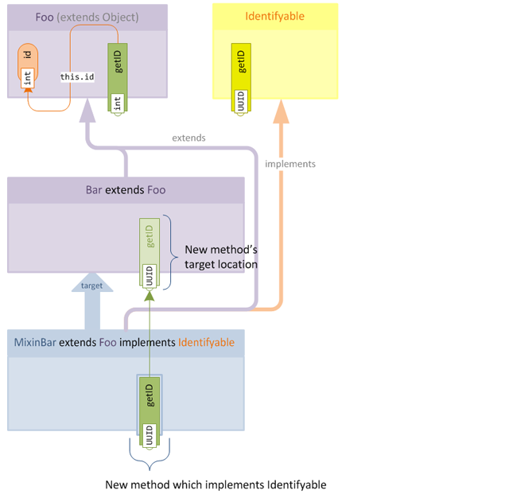
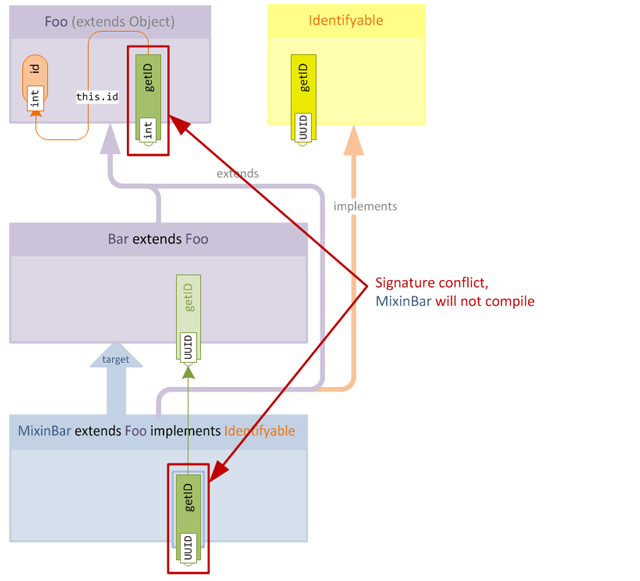
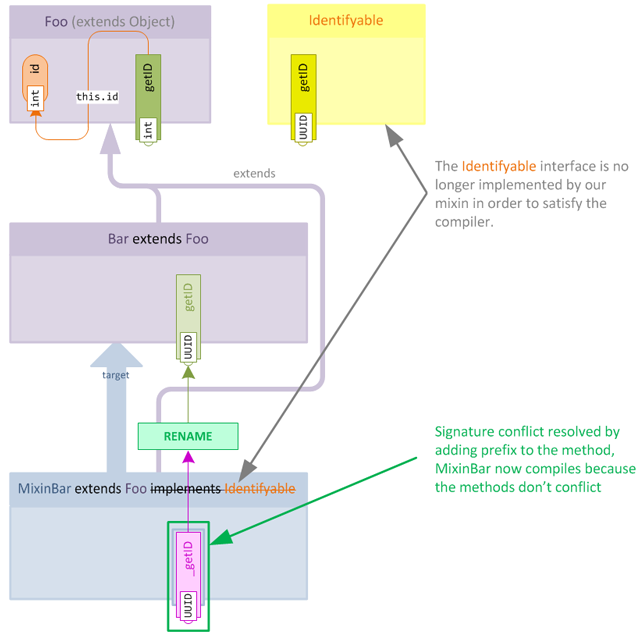
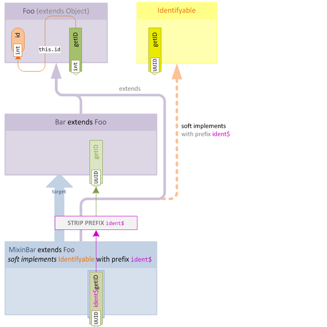
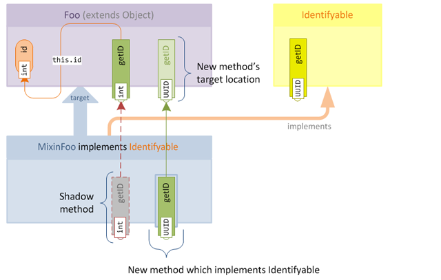

> 本教程翻译自：[Introduction to Mixins Resolving Method Signature Conflicts](https://github.com/SpongePowered/Mixin/wiki/Introduction-to-Mixins---Resolving-Method-Signature-Conflicts)

Mixin为我们提供了很大的权力来操作现有的类，其中最有用的就是如[本系列第一部分所说](https://github.com/SpongePowered/Mixin/wiki/Introduction-to-Mixins---Understanding-Mixin-Architecture)将新接口动态添加到现有类中。

然而，当我们希望添加的接口包含与目标类或其父类中现有方法冲突的方法声明时，问题就出现了。让我们来看一个简单的例子，看看问题是在哪发生的：

### 1. 问题

在我们的示例程序中，我们希望标记某些对象，以便跟踪它们的实例。我们定义一个名为`Identifyable`的新接口，它有一个名为`getID()`的方法，并将其混入到我们想要识别的目标类中。
```java
public interface Identifyable {

    /**
     * 获取该对象的ID
     */
    public abstract UUID getID();
}
```

我们选择使用Java的`UUID`类来作为标识符类型，并打算为我们混入的每个对象生成一个唯一的`UUID`实例。

但是，如果我们的一个目标类的父类已经定义了一个仅在返回类型上签名不同的方法，那么Java编译器就不会让我们编译我们的Mixin。为了知道原因，让我们来看看我们试图创建的代码结构。我已经用返回类型标注了每个访问器来表明问题：



父类中的`getID()`方法和我们试图定义的`getID()`方法仅在返回类型上不同。这种类型的重载不被Java支持，编译器会在我们尝试编译Mixin时报错：



然而，在驱动Java的引擎——Java虚拟机（Java Virtual Machine，JVM）中隐藏着一丝希望：JVM本身**确实**支持这种重载，只是Java语言不支持而已。这意味着，如果我们能以某种方式让编译器编译我们的代码，那么实际的类就可以正常工作了。

### 2. 绕过编译机制

如果Java不允许我们访问JVM，那么如何利用这一隐藏的功能呢？简单：我们使用一个假的方法来编译Mixin，并在应用Mixin时用我们想要的实际方法来替换它。我们的解决方案的第一阶段看起来是这样的：



在本例中，我们将下划线（`_`）作为方法的前缀，并在应用Mixin时使用重命名操作来从方法名中去除下划线。我们还从Mixin中移除了接口声明，因为编译器仍然足够聪明，即使方法定义在接口上也能够发现冲突。

所以现在我们知道了编译冲突方法的解决方案，但有两个新问题：

* Mixin处理器如何知道哪些方法需要去除前缀，以及前缀是什么？

* 如果这样做会立即导致与目标冲突，我们如何在Mixin上实现接口？

幸运的是，这两个问题都可以很容易地解决！

### 3. *软实现*一个接口

为了解决这些问题，我们将引入一个新的概念，即**软实现（Soft Implementing）**接口的思想。

通过软实现，我们将定义用于接口中方法的前缀，这解决了第一个问题；同时提供一种不实际使用`implements`关键字来声明接口实现的方法，这解决了第二个问题。



就最终效果而言，软实现提供了与让Mixin直接实现接口完全相同的功能，换句话说：

* 软实现的接口仍以与常规接口相同的方式被动态添加到目标类上。
* 有前缀的方法仍然被混入到目标类中（包括Overwrite语义——参见下节），并且只需由Mixin处理器去除任意前缀。

> **注意**：也可以在同一个Mixin中混合使用"硬"和"软"实现。

#### 3.1 声明软实现

如你所料，使用注解来声明软实现。让我们来看看上述例子是如何转换为Java代码的。

```java
@Mixin(Bar.class)
@Implements(@Interface(iface = Indentifyable.class, prefix = "ident$"))
public abstract class MixinBar extends Foo {

    private final UUID id = UUID.randomUUID();

    public UUID ident$getID() {
        return this.id;
    }
}
```

注意，在`@Implements`语句中，我们可以指定一个或多个`@Interface`注解来描述想要实现的接口。前缀的选择完全取决于你，但我建议在选择前缀时使用如下准则：

* 前缀以`$`符号结束。`$`通常被用作Java类的合成与结构部分中的分隔符，有助于从视觉上将前缀与被前缀修饰的方法名分开。例如`foo$getID()`比`foogetID()`更容易解析为两部分。如果您选择不使用`$`，那我建议使用下划线（`_`）作为合理的选择。

* 使用一个简短的字符串，它能让人联想到该前缀所关联的接口，这更容易将前缀方法与其软实现的接口联系起来。例如，选择`ident$`致敬了`Identifyable`接口，`id$`或`ifbl$`也是可行的。虽然允许使用更长的名称，例如使用`identifyable$`是完全合法的，但会导致代码难以阅读。同样，使用过于简短或不相关的名字如`foo$`或`a$`虽然合法，但不被鼓励。

注意，软实现接口的方法不**必须**使用前缀，实际上只有如上所述会冲突的方法才需要使用前缀。然而，使用前缀是有益的，因为它使Mixin处理器在应用时进行一些额外的验证。有前缀的方法会被检查是否为所声明接口的成员，如果方法稍后在接口中被删除或更改，则会产生可检测到的错误。

### 4. 回顾部分问题

因此，当实现父类中存在冲突方法的接口时，可能会发生签名冲突，但目标类中的方法也可能发生签名冲突。你可能会问自己，*"但是为什么？当然不会与目标类发生冲突，因为编译器在编译Mixin时不知道目标类中的方法？"*

答案当然是影子方法。

你可能还记得，在本系列的第一部分中，我们可以*通过"影射"来告诉Mixin处理器目标类中的方法和字段*，但当我们想添加的影子方法与我们添加的接口方法有签名冲突时，这当然会造成一个问题。

让我们修改上述示例，删除`Bar`，假设我们直接混入`Foo`：



我们可以很快发现，由于签名冲突，我们不能在目标类中添加`getID()`的影射。

幸运的是，Mixin处理器为我们提供了两种解决方案：

* 首先，我们可以**使用软实现**，就像上文所说，我们可以将接口实现变软以绕过编译器限制。
 
然而，当实现一个大型接口，仅单个（或至少少量）影子方法造成冲突时，这可能会带来不便。

* 或者，Mixin允许我们**为影子方法加上前缀**。

当少量影子导致问题时这是非常有用的，我们可以简单地重命名影子本身，以避免冲突。

#### 4.1 给影子加上前缀

与软实现不同，这没有单独的地方来定义影子方法的前缀。相反，前缀可以直接在Shadow注解中定义，如下所示：

```java
public abstract class MixinFoo implements Identifyable {

    @Shadow(prefix = "conflict$")
    public abstract int conflict$getID();

    public UUID getID() {
        // 返回唯一ID
    }
}
```

为了避免签名冲突，我们为影子定义了前缀`conflict$`。Mixin还提供了前缀的默认值，这可以在不显式定义前缀的情况下使用：

```java
@Shadow
public abstract int shadow$getID();
```

使用前缀`shadow$`可以重命名影子，而不需要显式地定义前缀。然而，为了提高可读性，建议在注解中始终明确地定义`prefix`，即使使用默认值。

### 5. 扩展延伸

前缀和软实现在**内部代理方法（Intrinsic Proxy Methods）**中也扮演着重要的角色，我们将在下一节中讨论。
